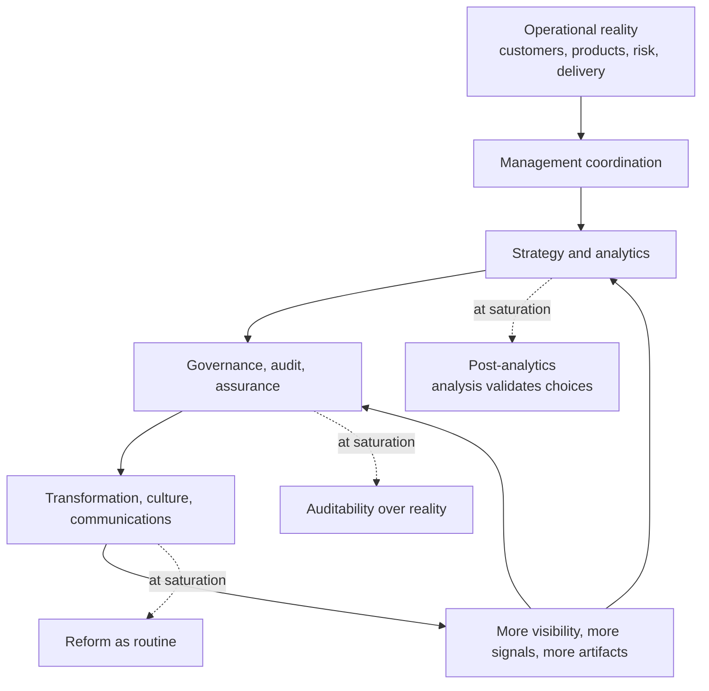

# Source Excerpts: Strategy Report Charts

Source: `~/Downloads/strategy-report.md`

These charts should come over to the executable-expectations essay set. They connect the organizational communication / dissent story to concrete operating mechanisms: evidence only matters when it changes the state of the system.

## Reversal stack inside corporate strategy

Use: conceptual support for the organizational communication reversal essay. It shows how corrective communication layers become self-referential and generate more meta-communication rather than more contact with operational reality.

## Evidence as decoration vs evidence as trigger

| Case | Industry | Pattern | What happened | What made evidence ceremonial or binding | Outcome |
|---|---|---|---|---|---|
| **Wells Fargo sales practices** | Banking | Failed / neutralized | Sales targets and compensation incentives spurred unauthorized-account behavior. | Cross-sell metrics were load-bearing and incentive-linked; the metric outranked customer reality. Evidence existed, but the operating incentive system consumed it. | Fines, reputational damage, board investigation, remediation. |
| **Boeing 737 MAX** | Aerospace | Failed / neutralized | Production pressure, faulty assumptions, and concealment overrode warning signals. | Schedule, cost, and competitive pressure overrode technical signals; review systems were not binding on program incentives. | Two crashes, 346 deaths, fleet grounding, governance crisis. |
| **Volkswagen diesel emissions** | Automotive | Failed / neutralized | Defeat-device software optimized the emissions test rather than real-world emissions. | Compliance became performance-for-the-audit instead of performance-in-reality. | Multi-billion-dollar settlements, enforcement, durable trust damage. |
| **Toyota TPS and andon/jidoka** | Manufacturing | Successful / enforced | Workers can trigger andon; machines or lines stop when abnormalities occur; leaders respond before defects flow downstream. | Evidence is not merely reported; it changes the state of the system immediately. Abnormality has a default action. | Quality and continuous-improvement advantages built on binding operational feedback. |
| **Booking.com experimentation system** | Travel / digital product | Successful / enforced | Product changes are validated through controlled experimentation infrastructure. | Testing is part of shipping rather than optional persuasion. | Compounding learning and durable experimentation capability. |
| **Capital One information-based strategy** | Financial services | Successful / enforced | Growth logic was built around scientific testing and segmentation. | Data and experimentation were part of the business model and operating capability, not advisory garnish. | Strong competitive differentiation in credit products and marketing. |

Use: central chart for the Work-to-Strategy Feedback / Dissent Mechanisms essay. It makes the key distinction concrete: evidence is ceremonial when it can be narrated away; evidence is binding when it triggers stops, gates, defaults, release decisions, or resource movement.

## Intervention families and absorption risk

| Intervention family | What it changes | Likelihood of ceremonial absorption |
|---|---|---|
| **Narrative discipline** | Better concept formation through memos, PR/FAQs, A3s | **High** if not tied to rights, funding, or experiments |
| **Decision-rights mapping** | Clarifies who recommends, agrees, performs, inputs, decides | **Medium**; helpful, but still absorbable without enforcement |
| **Forecast / prediction linkage** | Converts claims into scored forecasts later | **Low to medium** if scoring is public and recurring |
| **Reference-class challenge** | Brings outside-view base rates against optimism and misrepresentation | **Medium**; can be waived unless linked to approval gates |
| **Experiment / pilot gate** | Requires a test before wide rollout | **Low** where the test actually controls release |
| **Observability and audit trail layer** | Makes decisions and outcomes externally inspectable over time | **Low** if the client depends on the system to operate |
| **Default stop / kill criteria** | Makes continuation require explicit evidence | **Low** if default continuation is removed |
| **Budget lockbox / tranche release** | Ties capital movement to criteria rather than narrative | **Very low** once implemented |
| **Retained IP + recurring license or operating retainer** | Converts labor into owned asset economics | **Very low** from the consultant's perspective because upside sits outside ceremonial consumption |
| **Hybrid outcome-linked commercial model** | Aligns incentives and captures upside if the system moves metrics | **Low** if metrics are tight; **high** if metrics are noisy or political |

Use: optional follow-on chart if the essay turns toward solution-space or consulting/application. It may be too much for the conceptual essay, but it is useful source material for a later asset/control-surface piece.
