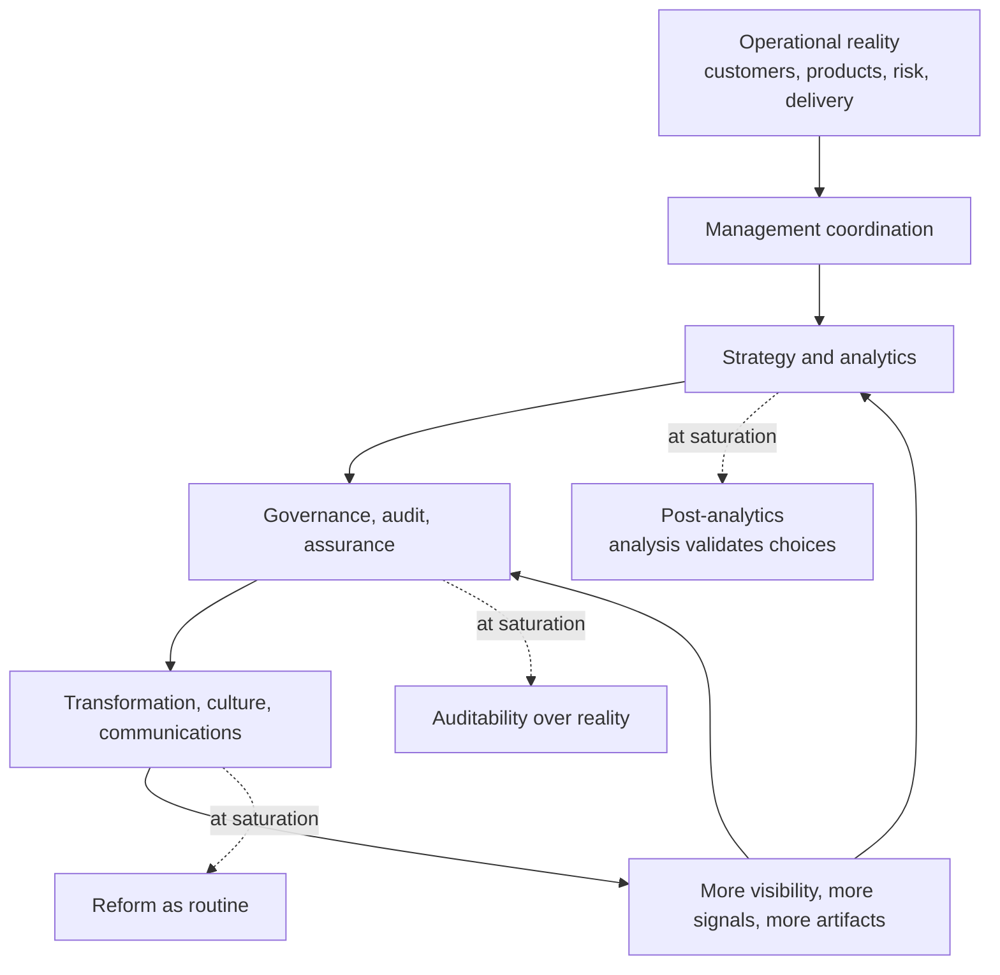

# Source Excerpt: Strategy Report Reversal Stack

Source: `~/Downloads/strategy-report.md`

This is the chart to carry into the executable-expectations flagship essay: the reversal stack inside company strategy, plus the mechanism rows mapping **Mechanism**, **What the literature says**, and **How it shows up in strategy and execution**.

The case table about evidence as decoration versus trigger is useful background, but it is not the chart being carried forward here. Failed cases that reveal reversal logic are captured separately in `.oh/sources/failed-case-reversal-examples.md`.

## Reversal stack inside company strategy

Use: conceptual support for the organizational communication reversal movement. It shows how corrective communication layers become self-referential and generate more meta-communication rather than more contact with operational reality.

## Mechanism table to carry

| Mechanism | What the literature says | How it shows up in strategy and execution |
|---|---|---|
| **Decoupling** | Formal structures are often adopted for legitimacy and then decoupled from ongoing activities; `confidence and good faith` substitute for tight coordination. | Strategy processes, scorecards, and governance forums exist and look rational, but resource allocation and behavior follow other logics. |
| **Organized hypocrisy** | Organizations satisfy some demands through talk or decisions and others through action; clear decisions can even compensate for contrary action. | Leadership teams enthusiastically `embrace` analysis, produce a decision record, and then keep prior commitments intact. |
| **Audit explosion and auditability** | Audit expands because accountability demands expand; audit is an active process of making things auditable, often by reshaping the object itself. | Teams optimize for what can be checked, sampled, scored, or displayed. Strategy becomes auditable performance rather than real performance. |
| **Transparency paradox** | Too much observability can reduce learning by inducing concealment; zones of privacy can improve performance and experimentation. | Real-time dashboards, chat visibility, and public review culture discourage exploratory deviation and increase safe performance. |
| **Reform as routine** | Reforms are often self-referential, driven by problems, ready-made solutions, and forgetfulness; they recur as routines. | New planning systems, PMOs, agile resets, OKR relaunches, and culture programs appear in cycles without resolving the base problem. |
| **Post-analytics** | This is an analytical extension of Mir's postjournalism/news-validation logic to company evidence. Mir argues digital abundance turns journalism from news supply toward validation; the company analogue is evidence becoming validation for choices already favored. | Analysis produces defensible narratives, not binding choices. More data means more optionality in interpretation. |

## Carry-forward note

This belongs with the Organizational Communication / Communication Reversal movement of the flagship essay. It is not primarily a Toyota case chart. The point is the stack: operational reality produces communication layers meant to improve control; at saturation those layers create post-analytics, auditability-over-reality, and reform-as-routine. The mechanism table is the reader-facing bridge from literature to how the reversal appears inside strategy and execution.

The failed cases still matter as examples. Volkswagen, Wells Fargo, and Boeing show the reversal in its strongest form: the system becomes better at staging compliance than at achieving the underlying objective. Use them as referenced examples, not as a substitute for the reversal-stack chart.