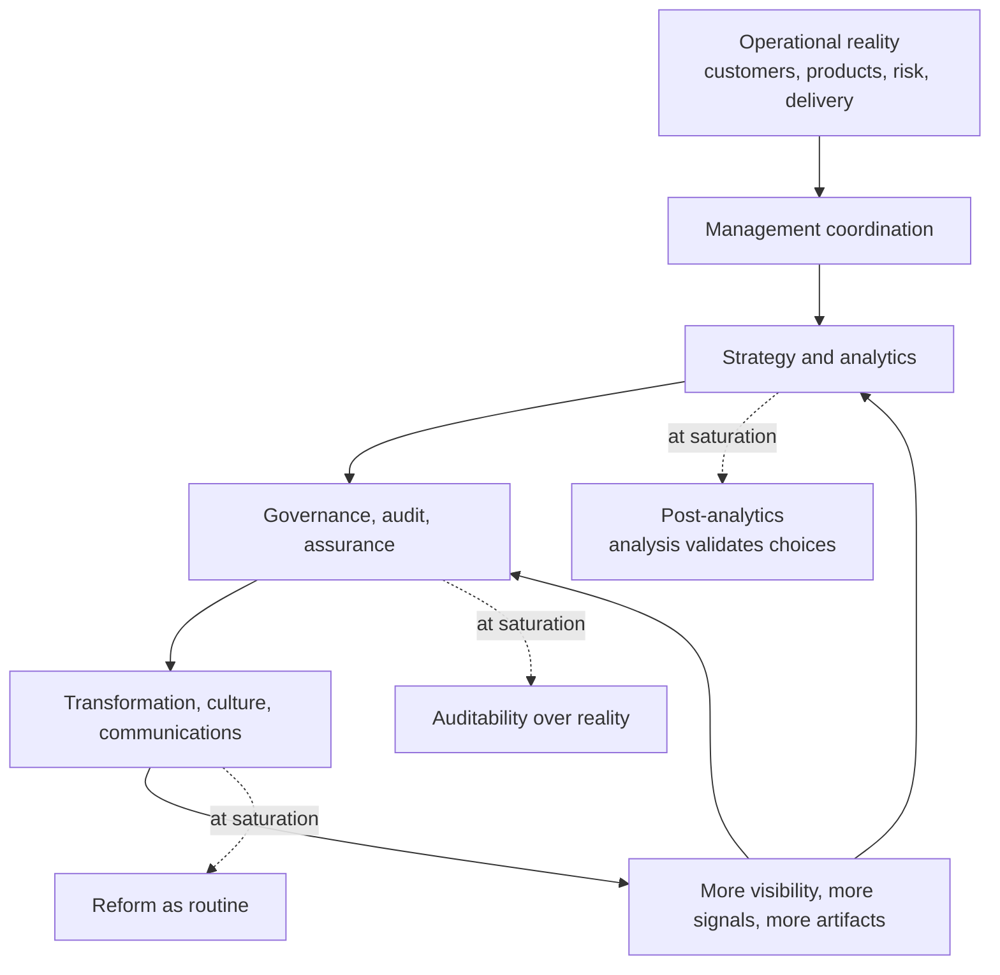

A report generates a review.

The review generates an action register. The action register generates a dashboard. The dashboard generates a governance concern. The governance concern generates a transformation program. The transformation program generates stakeholder communications. The stakeholder communications generate engagement telemetry.

Nothing in that chain is obviously fake. Each step can be defended. Each one begins as a reasonable response to a real coordination problem. The report tries to make the work visible. The review tries to make the report accountable. The action register tries to prevent drift. The dashboard tries to make the register legible. Governance tries to make the dashboard consequential. Transformation tries to fix the pattern behind the concern.

And still, somewhere in the chain, the organization becomes extraordinarily busy responding to evidence that it is responding.

That is the reversal.

Organizational communication was not originally a layer of corporate decoration. In scaled organizations it was the medium that let work outlive memory, travel beyond proximity, and remain coherent across distance. Ledgers, memos, budgets, procedures, schedules, org charts, reports, tickets, specifications, and records of authorization made large-scale action possible. A rule could survive its author. A decision could travel. A budget could authorize one action and prohibit another. A report could connect local events to central judgment.

At its strongest, communication did three things at once: it represented reality, coordinated action, and preserved a record against which action could later be judged.

The reversal begins when those three functions separate. The representation of competent action becomes more consequential than competent action itself.

This is not a complaint about too many meetings. It is not a complaint about jargon, although jargon often marks the condition. It is a structural failure in the medium of organization. Communication created to control action becomes abundant enough that action is subordinated to communication: to narration, auditability, alignment, reform, reassurance, and retrospective coherence.

The organization does not stop acting. It keeps shipping, selling, reconciling, approving, escalating, planning, hiring, and transforming. But more and more of its energy goes into maintaining the communicative surface through which those actions are recognized as legitimate.

## The stack that turns back on itself

The path usually looks like a reasonable stack of controls.

Operational reality creates coordination problems. Coordination creates management. Management creates strategy and analytics. Strategy creates governance, audit, and assurance. Governance creates transformation, culture, and communication programs. Those programs create more visibility, more signals, and more artifacts, which feed back into strategy and governance.

At ordinary scale, that stack is useful. The problem is saturation.

When strategy and analytics saturate, analysis stops being a binding encounter with reality and becomes a way to validate choices already favored. When governance and audit saturate, the system starts optimizing for what can be inspected rather than what is true. When transformation and culture saturate, reform becomes a recurring organizational routine: another reset, relaunch, planning system, operating model, PMO, agile reboot, values campaign, or alignment exercise.

The stack turns back on itself. Communication layers meant to improve contact with operational reality begin generating more meta-communication instead.

## The mechanisms are recognizable

The reversal does not require conspiracy. It can emerge from ordinary incentives, incompatible demands, and the need to appear controlled in public while preserving flexibility in private.

| Mechanism | What the literature says | How it shows up in strategy and execution |
|---|---|---|
| **Decoupling** | Formal structures are often adopted for legitimacy and then decoupled from ongoing activities; confidence and good faith substitute for tight coordination. | Strategy processes, scorecards, and governance forums exist and look rational, but resource allocation and behavior follow other logics. |
| **Organized hypocrisy** | Organizations satisfy some demands through talk or decisions and others through action; clear decisions can even compensate for contrary action. | Executive teams enthusiastically embrace analysis, produce a decision record, and then keep prior commitments intact. |
| **Audit explosion and auditability** | Audit expands because accountability demands expand; audit is an active process of making things auditable, often by reshaping the object itself. | Teams optimize for what can be checked, sampled, scored, or displayed. Strategy becomes auditable performance rather than real performance. |
| **Transparency paradox** | Too much observability can reduce learning by inducing concealment; zones of privacy can improve performance and experimentation. | Real-time dashboards, chat visibility, and public review culture discourage exploratory deviation and increase safe performance. |
| **Reform as routine** | Reforms are often self-referential, driven by problems, ready-made solutions, and forgetfulness; they recur as routines. | New planning systems, PMOs, agile resets, OKR relaunches, and culture programs appear in cycles without resolving the base problem. |
| **Post-analytics** | Digital abundance turns some evidence systems from supplying new information toward validating the interpretation already in circulation. The corporate analogue is evidence becoming validation for choices already favored. | Analysis produces defensible narratives, not binding choices. More data means more optionality in interpretation. |

These mechanisms explain why the reversal feels so hard to fight from inside. The organization can be full of intelligent people, sincere leaders, good analysts, committed operators, and real controls. The failure is not that nobody knows better. The failure is that knowing better does not automatically change the state of the system.

A risk can be acknowledged without changing the launch date. A metric can be criticized without changing the incentive plan. A customer failure can be summarized without changing the product. An employee concern can be received without changing authority. A strategy review can note a contradiction while keeping the portfolio intact.

Evidence becomes received. It does not become causal.

That is why corporate drivel is often load-bearing. Its vagueness permits incompatible interests to coexist. Its optimism prevents the coalition from naming losers. Its abstractions demonstrate rationality without creating constraints. Its reception rituals allow evidence to be acknowledged without acquiring power.

## Failed cases show the strong form

The strongest public failures are useful not because they are exotic, but because they make the pattern impossible to miss. The same reversal appears in smaller forms whenever measurement, auditability, schedule, governance, or reporting becomes more consequential than the underlying objective.

Volkswagen is the cleanest auditability example. The U.S. Environmental Protection Agency's 2015 Notice of Violation said Volkswagen used software that detected when vehicles were undergoing emissions testing and switched emissions controls on during the test, while reducing those controls during normal driving. The notice said nitrogen oxide emissions could be up to 40 times the standard in normal operation. The reversal was not simply lying. It was performance-for-the-test replacing emissions reality. The system recognized the audit condition and optimized the ceremony the audit could see. [EPA Notice of Violation](https://www.epa.gov/sites/default/files/2015-10/documents/vw-nov-caa-09-18-15.pdf)

Wells Fargo shows the metric version. The Consumer Financial Protection Bureau announced a $100 million penalty for the widespread illegal practice of secretly opening unauthorized accounts. Cross-sell counts had become load-bearing communication: a number that said the bank was deepening customer relationships. The organization optimized the count while violating the customer reality the count was supposed to represent. The metric did not merely measure behavior; it organized behavior around producing the appearance of customer value. [CFPB enforcement action](https://www.consumerfinance.gov/enforcement/actions/wells-fargo-bank-2016/), [OCC release](https://www.occ.gov/news-issuances/news-releases/2016/nr-occ-2016-106.html), [SEC order](https://www.sec.gov/files/litigation/admin/2020/34-88257.pdf)

Boeing shows the governance version. The House Transportation Committee's 737 MAX report described production pressure, faulty assumptions, and a culture of concealment. The DOT Inspector General later reported weaknesses in FAA certification and delegation processes. Formal safety systems existed. Reviews existed. Certification processes existed. But schedule, cost, competitive pressure, and delegated review channels weakened the system's capacity to let safety evidence exercise real veto power. The reversal was formal safety communication without safety communication remaining causally sovereign. [House Transportation Committee report](https://democrats-transportation.house.gov/imo/media/doc/2020.09.15%20FINAL%20737%20MAX%20Report%20for%20Public%20Release.pdf), [DOT OIG report](https://www.oig.dot.gov/sites/default/files/FAA%20Certification%20of%20737%20MAX%20Boeing%20II%20Final%20Report%5E2-23-2021.pdf)

These cases are not morality plays about bad companies over there. They are the high-stakes version of a common organizational pattern: the system becomes better at staging compliance than at achieving the underlying objective.

Most organizations have smaller versions. The dashboard is green because the only red cases were excluded as out of scope. The roadmap is on track because the definition of the milestone changed. The customer health score improves while escalations move into private channels. The risk register is current while the actual decision path runs through a different room. The transformation program celebrates adoption while the workarounds carry the business.

The failure is not that communication exists. The failure is that communication has become easier to satisfy than reality.

## Digital orality: written text behaving like speech

The contemporary organization still produces enormous amounts of text. It just no longer behaves like durable text.

Slack messages, Teams threads, live documents, comments, meeting transcripts, decks, AI chats, and rapidly edited plans are written, searchable, timestamped, and often retained. But in practice they behave like speech in a permanent crowd. They are immediate, conversational, audience-aware, status-sensitive, provisional, emotionally responsive, and continuously superseded by the next exchange.

The organization lives in the stream.

Its effective state is not necessarily what the strategy says. It is the current balance among the last executive conversation, the latest escalation, the current dashboard, the loudest constituency, the newest board concern, the most recent customer anecdote, the last model-generated recommendation, and the action someone with power has already set in motion.

That is why organizations keep invoking a "source of truth." The phrase appears most often when no source is authoritative enough to bind the stream.

The result is strange. Organizations have more recorded communication than any organizations in history, yet often less ability to reconstruct what mattered:

| Question | Why the stream cannot answer it reliably |
|---|---|
| What did we actually believe? | Beliefs were distributed across meetings, documents, chats, dashboards, and post-hoc summaries. |
| Why did we change direction? | The official rationale may be cleaner than the causal path. |
| What evidence mattered? | Evidence may have been acknowledged, discounted, reframed, or used only after a choice was already made. |
| Who overrode whom? | Authority often appears as momentum, not as an explicit state transition. |
| Which assumptions were active? | Assumptions travel implicitly inside plans, prompts, metrics, and inherited defaults. |
| What outcome followed? | The organization moves on before measuring whether the change did what it claimed. |
| When did the current rationale replace the original one? | Live documents and summaries overwrite the sediment that would have shown the change. |

The abundance of records reverses into the absence of a record. Not because nothing was saved, but because too much was saved without lineage, epistemic type, authority, consequence, or state change.

## LLMs complete the reversal

LLMs intensify this condition because they collapse communication and implementation.

Previously, a direction had to move through expensive transformations: idea, discussion, specification, implementation, review, release. Those stages were frustrating, slow, political, and lossy. They also left sediment. There were tickets, specifications, design arguments, commits, reviews, release notes, and approval processes. Some of that sediment was bureaucratic waste. Some of it was the only evidence the organization later had for why the system behaved as it did.

Now someone can type: "Change the workflow so that these cases are handled differently."

An agent can modify a system prompt, routing logic, configuration file, application code, evaluator, and deployment artifact. The instruction may be vague. The implementation may be distributed across dozens of files. The rationale may exist only in one transient conversation. The change can be shipped before the organization has formed a stable conception of what it changed.

Then the next person or agent issues another instruction. The current artifact remains. The chain of judgment vanishes.

This is not just a documentation problem. It is a new operating condition: the rate of mutation can exceed the rate at which the organization retains continuity of intent.

LLMs reduce the cost of action. They also reduce the friction that once forced some reasoning to become explicit. The AI-native organization can therefore become pure present tense: immediately mutable, richly instrumented, endlessly explainable after the fact, and unable to reconstruct why it became what it is.

Communication no longer preserves the organizational past so that future action can remain coherent. Communication continuously rewrites the present.

This is why the June 13 pieces argue that the workflow and domain harness matter more than the agent as an object. In [Agents Don't Learn the Domain. The System Does.](/posts/agents-dont-learn-the-domain-the-system-does/), the useful learning happens when a failure becomes a durable domain artifact. In [There Is No Agent Workflow Runtime](/posts/there-is-no-agent-workflow-runtime/), the runtime has to preserve what can be versioned, replayed, observed, governed, tested, and promoted. Those are not infrastructure preferences. They are defenses against mutation without memory.

## Why the obvious remedies fail

The standard remedies are almost all content-level interventions. Write better documentation. Keep decision logs. Summarize meetings with AI. Create a knowledge base. Use six-page memos. Demand clearer priorities. Introduce stronger governance. Relaunch the culture program. Say there can only be one priority.

Some of these help locally. None of them changes the medium.

Better documentation usually arrives after the work, competes with the next urgent task, and decays. When mandatory, it becomes a compliance artifact. The organization learns to produce the appearance of explanation.

Decision logs often capture the declared rationale, not the causal process. The log says, "We selected Option B because it best supports strategic flexibility." It may not say, "The executive had already committed to Option B, the analysis was commissioned afterward, and the team reframed the recommendation to preserve the relationship." The log can become the official myth of the decision.

AI summaries can make this worse. They turn conflict, confusion, power, contradiction, and unresolved ambiguity into a clean paragraph: "The team aligned on a path forward." The generated coherence may be exactly what never existed.

Stronger governance creates another representational layer. The organization can perform compliance with the new process while leaving the actual decision channel untouched. A new committee can make the old room more deniable.

One-priority slogans are logically attractive and organizationally weak. The word priority often functions not to rank action but to acknowledge constituencies. Ten priorities preserve the coalition. One real priority would reveal whose commitments are being abandoned. The organization does not need help understanding the dictionary. It needs a mechanism for changing resource allocation, authority, and stop conditions.

Culture programs are the purest example of absorption. The attempt to change defensive routines becomes a new language through which defensive routines are performed. People learn the words for candor, learning, experimentation, and accountability while the assumptions governing action remain untouched.

These remedies fail because they add more communication to a system whose dominant pathology is the separation of communication from consequence.

The answer cannot be one more polished representation. It cannot be a larger archive of what everyone said. It cannot be AI-generated coherence pasted over unresolved contradiction. It cannot be audit society at machine speed.

## The second reversal

The first reversal ran like this: human memory became written organizational memory; written organizational memory became managerial communication systems; managerial communication systems became communication abundance; communication abundance became ceremony and reactivity; LLMs turn ceremony and reactivity into AI-accelerated amnesia.

The way out is not nostalgia for the memo. It is not restored print bureaucracy. It is not making everyone write better documents.

The organization needs a second reversal: the same digital medium that destroys memory through instantaneous mutation must be used to capture consequential mutation as it occurs. The same LLM that can generate changes without sediment must help reconstruct sediment. The same conversational stream that dissolves authority must become input to a durable, inspectable history. The same expert correction that now disappears into a thread must be capable of changing future behavior.

That does not mean every utterance should be captured, every decision explained, every lesson bound, every action tracked, or every exception eliminated. Push that far and the remedy reverses into the final form of the audit society: an omniscient organizational memory that makes genuine thought and experimentation impossible.

The second reversal has to be selective and consequential. It has to preserve the difference between fact and inference. It has to remember selected changes when they matter to future action. It has to let prior learning constrain future mutation without turning every past note into dead doctrine.

The prior dissent piece named one missing interface: evidence from the work needs a route back into strategy with state-changing power. The next pieces move from diagnosis to design: how variation enters a reliable process without becoming uncontrolled production variation, and how a concrete Recon Agent harness can turn a domain correction into schema'd input and output, a regression case, and behavior that changes the next run.

This essay is only the diagnosis. Organizational communication has not become useless. It has become too powerful to leave as unconstrained representation. The counter-medium has to make accumulated experience harder to erase, easier to interrogate, and capable of changing what happens next.
