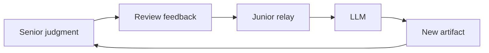
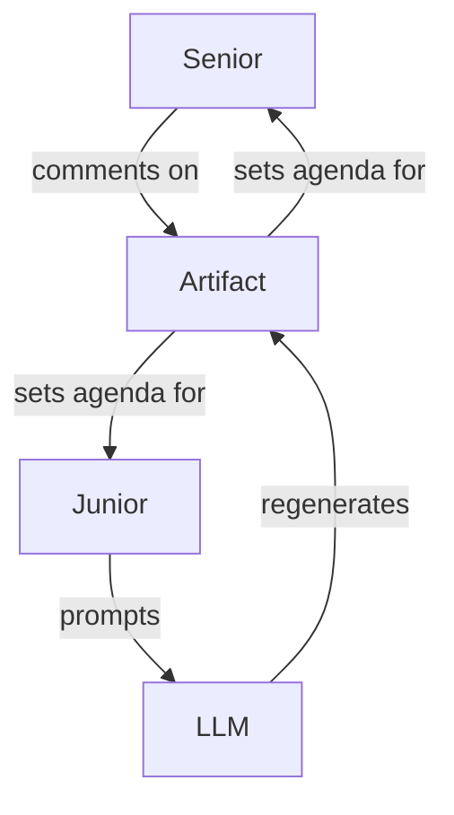

# When the PR Looks Real
# but the Author Doesn’t Own It

The new BS filter is fidelity, not formality.

<!--
Opening question: Have you reviewed a polished PR that kept changing shape but never got closer to the design?
Let the room answer before naming AI.
-->

---
layout: center
class: text-center
---

# The polished PR that won’t converge

Senior gives direction. 
Junior returns a credible PR. 
The design solves a nearby problem.

<!--
Start with the social scene. No thesis yet.
-->

---
layout: two-cols
---

# The review gets stranger

::left::

## Feedback names mechanism

- boundary
- invariant
- production constraint
- tradeoff
- behavior, not implementation

::right::

## Revision loses mechanism

- new structure
- new names
- new tests
- phrases addressed
- intent missed

<!--
Emphasize the eerie part: each revision can look better in isolation while the sequence fails to converge.
-->

---
layout: center
class: text-center
---

# Everyone sees activity

PRs

comments

tests

iteration

Motion can hide non-learning.

---
layout: center
class: text-center
---

# What nobody says out loud

We are not converging. 
The author cannot explain the design. 
Comments survive. Mechanism disappears.

<!--
This is the missing stop-the-line moment.
-->

---
layout: center
class: text-center
---

# The hidden third party

The senior reviews model output through a human transport layer.

---
layout: center
class: text-center
---

# The human loop has become a prompt loop

Senior judgment → prompt context → generated artifact 
→ author explanation → code and tests → production behavior

<!--
Land the memorable line. Then define fidelity as survival across this chain.
-->

---
layout: center
class: text-center
---

# The old BS filter broke

The organization mistakes 
artifact velocity 
for 
judgment transfer.

---
layout: center
class: text-center
---

# Code got cheap
# Understanding did not

Code tests plans summaries explanations

Memory judgment constraints tradeoffs learning

---
layout: center
class: text-center
---

# Triangulation replaces apprenticeship

Both humans begin orbiting generated output.

---
layout: two-cols
---

# Formality used to carry signal

::left::

## Before

- a plan took time
- a PR required a system model
- review exposed reasoning

::right::

## Now

- plans can be generated
- tests can mirror false assumptions
- explanations can rationalize confusion

<!--
Be fair to the old world. It was imperfect, but cost carried signal.
-->

---
layout: center
class: text-center
---

# The dashboard can get greener
# while the system gets less true

| Metric | Failure mode |
| --- | --- |
| PR count | understanding falls |
| Cycle time | drift accelerates |
| Test count | false model gets tests |
| Review speed | shallow review passes slop |

---
layout: center
class: text-center
---

# New question

Did judgment survive translation?

Fidelity means distinctions survive each handoff.

---
layout: two-cols
---

# Reality fidelity

::left::

## Before generation

Ask:

- aim
- constraints
- landmines
- domain distinctions
- blocking question

::right::

## Filter

Can each constraint be traced to:

- code
- tests
- config
- observability
- operations
- tradeoff

---
layout: two-cols
---

# Drift detection

::left::

## Signals

- same files churn
- comments satisfied literally
- mechanism violated
- architecture shifts without explanation
- author cannot explain direction

::right::

## Stop-the-line trigger

The mechanism is no longer owned by the author.

---
layout: two-cols
---

# Judgment fidelity

::left::

## Start review here

> Walk me through the design from memory.

Then ask:

- why necessary?
- why sufficient?
- why viable?
- what would prove this wrong?

::right::

## Good rationale names

- mechanism
- cost
- acceptance condition
- revisit trigger

---
layout: two-cols
---

# Outcome and learning fidelity

::left::

## After ship

Did the system become more true in production?

- behavior
- reliability
- support burden
- operator decisions

::right::

## When work fails

What did we learn that is still true?

- spec
- guardrail
- decision
- assumption
- warning

---
layout: center
---

# The operating move

1. Aim before generation
2. Generate under constraint
3. Review through necessity, sufficiency, viability
4. Test ownership
5. Stop the line on drift
6. Salvage learning, not code
7. Reflect so learning compounds

---
layout: center
class: text-center
---

# Formality is cheap
# Fidelity is scarce

The next polished PR that fails to converge starts with one question: 
<strong>does anyone still own the mechanism?</strong>

<!--
Closing discussion question: where would this filter fire first in your team — before work, during revisions, at review, after ship, or when a branch goes bad?
-->
