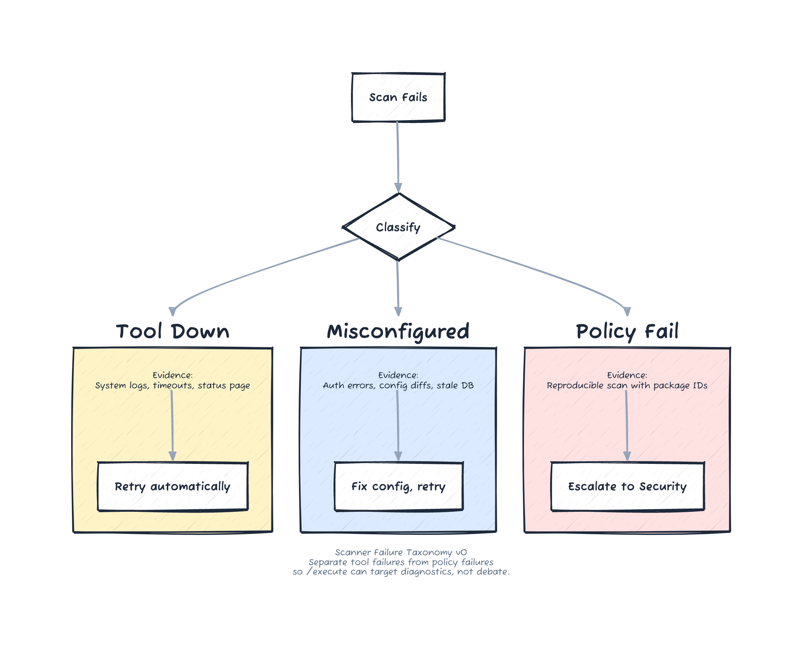
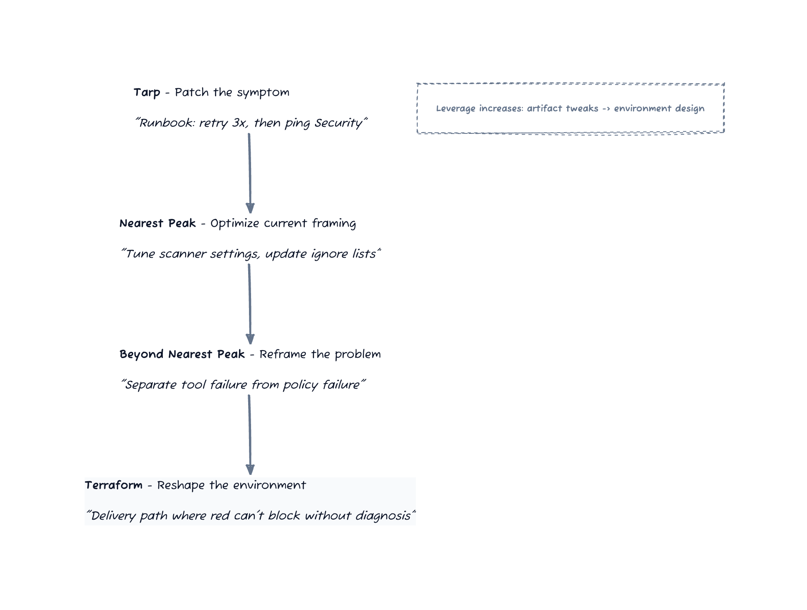

# Episode 1 — The Waiting Room

Rina kept her camera off. She said it was “bandwidth,” but Myles had learned to hear the other meaning: *containment*. If she was off-camera, she could keep her face neutral. She could absorb tension without reflecting it back.

Ten minutes before the call, Myles had asked if Harborview still released twice a week. Rina had given him a look that said *it doesn’t matter*. Twice a week, twice a month, the delivery path was the same: long, brittle, and filled with stop-signs nobody believed in but everyone obeyed.

“Today isn’t about fixes,” Rina had said as she clicked into the meeting. “We’re here to make their apathy visible. If we can show it, we can move it.”
On the call, Harborview Health’s release manager, Dana Patel, read from a spreadsheet like a prayer.

“SBOM scan failed in staging. Again. We’ll retry after lunch. If it’s still red we’ll open a ticket with Security.”

She didn’t look up when she said it. It sounded like she’d said it for years.

On the other tiles: a security lead in a polo with a hospital logo; a compliance analyst whose mic crackled; a VP who never spoke. No one looked surprised. No one looked angry. They looked… practiced.

Jonah sent a private message to Myles: **they’ve normalized the tax.**

Kieran, sitting beside Myles in the Northstar office, leaned back in his chair. “That’s just hospitals,” he said under his breath. “Governance is governance.”

“Governance is physics,” Myles replied. “This is self-harm.”

Dana kept reading. “Also: build 1472 sat in approval for six hours because Security was in a drill. We pushed to next day.”

Rina came on audio. “Thanks, Dana. We’re here to help. Let’s start by mapping the constraints we treat as real. That’s the only way we stop pretending.”

She waited until Dana nodded, then gave Myles the go-ahead. He opened a shared doc and typed in full view of the room.

## /problem-space

**What we’re optimizing:** safe deployments that happen reliably during business hours.  
**Constraints we treat as real:** compliance gates, audit trails, limited IT support, weekend staffing.  
**Constraints we should question:** manual approvals, non-deterministic scanners, “retry until green.”

There was a pause. Dana read the bullets twice.

“I mean, yes,” she said. “But… that’s just how it is.”

She scrolled on her own sheet. “We also have dual attestation for anything touching patient billing. It’s policy. That adds a day. Then Security needs a clean scan before change control will sign. If the scan goes red, the approvals expire. So we start over.” She added, almost casually, “A red scan starts a remediation clock. Compliance gets notified, and the window is public inside the hospital. Nobody wants to be the name on that.”

“That’s a delivery-path tax,” Jonah said. “You’re paying it in attention, not just time.”

“Attention is finite,” Rina added. “Meetings are serial. The tax compounds.”

Dana let out a small laugh that wasn’t a laugh. “We have a joke in Release Ops: ‘If you want it fast, don’t want it safe.’”

Myles felt the familiar heat. The first time he saw a stuck system, he assumed it didn’t know any better. The tenth time, he realized the scarier truth: it *knew*, and it had built a life around not changing.

“‘Just how it is’ is not a constraint,” he said. “It’s a habit.”

Rina kept her voice gentle. “If we can’t name the constraints, we can’t change them. Your delivery path is the reality. Your `/ship` path is where the tax hits, not in Jira. Let’s keep going.”

Dana’s eyes flicked to the word `/ship` and back to Rina’s tile.

---

They took a breath and moved to outcome.

“Define the aim,” Rina said. “Not the feature. The behavior.”

Myles typed again.

## /aim

**Aim:** Harborview can ship a change to production *without heroics*—no midnight retries, no tribal knowledge, no “hope it passes.”

Kieran muttered, “That’s not an aim. That’s a vibe.”

Jonah glanced at him. “It’s measurable,” he said. “Percent of releases that require manual intervention. Mean time to recover from a scan failure. Number of approval clicks.”

Dana rubbed her temple. “We can’t remove the gates.”

“We’re not removing gates,” Myles said. “We’re making them deterministic.”

He turned his laptop toward the camera so the room could see his pen. “Acceleration is seductive. Alignment is scarce. If we don’t align on mechanism and feedback, we’re just going fast at the same wall.”

The VP’s tile flickered. “We’re not asking for acceleration,” she said. “We’re asking for predictability.”

“That is alignment,” Jonah said, almost to himself. “That’s the constraint.”

Dana leaned in. “But it still takes meetings. Every approval is a meeting. Every exception is a meeting.”

Rina nodded. “Meetings are serial. Attention is finite. That’s the tax. Let’s make it visible.”

Myles drew a line down the page and labeled a new section.

## /solution-space

**Band-aid:** add a runbook. "If scan fails, retry three times, then ping Security."
**Local optimum:** tune scanner settings, update ignore lists, hope the flakes stop.
**Reframe:** isolate scanning to smaller artifacts; cache results; add retries with evidence; separate "scanner down" from "real vuln."
**Redesign:** change the delivery path so "random red" can't block progress without a diagnosis.

The room was quiet. Not engaged quiet. The other quiet. The one where people wait for the meeting to end so they can go back to the system they don’t believe can change.

Rina saw it too. She saved everyone with a procedural question. “What would make this wrong?”

---

The doc cursor blinked like a dare. Myles exhaled. A door.

## /dissent

What would make this wrong?
- If scan failures are always real vulnerabilities (they aren’t).
- If compliance requires manual re-approval on retry (it doesn’t).
- If we can’t separate tool failure from policy failure (we can).

The security lead, Martin, spoke up for the first time. “Half our failures are network. It’s not that the code is unsafe. It’s that the scanner times out. We get paged because the tool hiccups.”

Dana’s shoulders dropped in the smallest way, like she was relieved someone else said it first.

The compliance analyst cleared her throat. “The policy isn’t ‘manual approval forever.’ It’s ‘manual approval when the system can’t prove it’s safe.’ We just… never got the system to prove it.”

Myles nodded. “So the policy is conditional. We just treat it as absolute because the evidence isn’t there.”

The VP finally spoke. “If you can make it diagnosable, I can change the way the policy is applied. But I can’t do that on a gut feeling.”

Myles felt a small click: the first piece of truth from inside the client. Not a complaint. A fact.

Jonah typed a note beneath the dissent list. **tool failure masquerading as governance.**

Rina, still off-camera, said, “Thank you. That changes what we test tomorrow.”

The call ended the way most calls ended. Polite thanks. Follow-ups. A ticket to investigate the scanner. Nothing changed yet.

Rina kept the line open. “Dana, two minutes?”

Dana hesitated, then nodded. The VP dropped. The compliance analyst left.

“Is it always this quiet after the call?” Rina asked.

Dana looked at her notes. “We call it the waiting room. You wait for the tool. You wait for Security. You wait for the next window. That’s the job.”

“And heroics?”

“They’re the tax you pay to pretend the system works.” Dana’s voice dropped. “I’m not proud of it. I just don’t see how to change it without changing policy.”

Rina said, “Tomorrow isn’t about policy. It’s about evidence. If we can diagnose, we can use the policy you already have.”

Dana exhaled. “If you can make it diagnosable, I’ll be there.”
---

In the Northstar office, the quiet was louder. Kieran spun his chair toward Myles.

“We mapped the problem. Great. But we’re still stuck. We need the scanner vendor to fix their thing.”

Myles didn’t argue. He opened the shared doc again and wrote the reframe where Kieran could see it.

## /problem-statement

Old statement: “How do we stop the scanner from failing?”  
New statement: “How do we make scan failures diagnosable and recoverable without human heroics?”

Rina leaned into the open mic. “That statement doesn’t ask for permission. It asks for evidence.”

Jonah nodded. “If we can’t diagnose, we can’t recover. The delivery path stays magical.”

Myles tapped the desk. “We need a taxonomy before we need a fix.”

Kieran frowned. “A taxonomy? For a broken scanner?”

“For broken outcomes,” Myles said. “So tomorrow isn’t about feelings.”

Jonah opened a new page and titled it in the same shared doc. He read each line aloud as he typed.

**Artifact 1: Scanner Failure Taxonomy v0**  
**Purpose:** Separate tool failures from policy failures so `/execute` can target diagnostics, not debate.

- **Tool down:** scanner service unavailable, timeout, network path unstable. Evidence: system logs, timeouts, status page.
- **Tool misconfigured:** credentials expired, wrong endpoint, out-of-date signature DB. Evidence: auth errors, config diffs.
- **Policy fail:** real vulnerability exceeds threshold. Evidence: reproducible scan with package IDs.

Rina said, “This is the first reusable thing Harborview can keep.”

Myles circled the words *tool down* and *policy fail* with his cursor. “Those two categories are the difference between retrying and escalating. They’re the difference between an on-call night and a normal night.”

Kieran stared at the taxonomy longer than he wanted to. “Fine. That’s useful.”

“Now we execute,” Myles said.

He wrote the smallest slice that could test the mechanism and reduce heroics without asking for a re-org.

## /execute

Pre-flight:
- agree on the taxonomy categories and the evidence required for each
- pick one service in staging and one scan window

Build:
- add deterministic retries with backoff
- add explicit error classification and logging against the taxonomy

Detect drift:
- if we’re debating policy instead of making failures diagnosable, stop

Ship:
- roll out to staging for one service and measure manual intervention rate

Rina looked up at the clock. “We need a way to carry this into tomorrow without turning it into a ceremony.”

Jonah opened a new file. “Dive Pack.”

He wrote the title as if he were writing a label on a bin.

**Artifact 2: Harborview Dive Pack — Scanner Slice**  
**Purpose:** Minimal context for tomorrow’s `/execute` so we don’t repeat today’s meeting.

- **Aim:** Ship one staging change without heroics.
- **Constraints:** compliance gates stay; scanner stays; audit trail required.
- **Landmines:** manual approvals are slow; tool timeouts create false reds.
- **Mechanism:** classify failures to route to the right response.
- **Feedback:** manual intervention rate; time from failure to diagnosis.

Kieran smirked. “You just made a checklist.”

Rina smiled, barely. “A checklist that removes two meetings. That’s a win.”

---

They booked a fifteen-minute follow-up with Harborview for the next morning. Dana joined from her kitchen, hair wet, coffee in hand.

Myles didn’t waste the time. “We have a slice. It doesn’t ask you to change policy. It asks you to stop guessing.”

He shared the taxonomy. Dana read it twice.

“Tool down versus policy fail,” she said slowly. “That would cut our back-and-forth in half.”

“And it keeps the gate intact,” Rina added. “It just makes the gate honest.”

Dana exhaled. “Okay. We can do one service, one window. I’ll get Martin. It reduces heroics.”

“Tomorrow,” Myles said. “We run `/execute` on a different statement.”

No one said it was impossible. That was the first crack.

---

*The taxonomy that made failures diagnosable:*

*The four levels of response—from patch to reshape:*

---

## End-of-Episode Memo (Northstar)

**What shifted**
- The client named a real mechanism: scanner failures are often tool/network issues, not vulnerabilities.
- Apathy cracked when Harborview saw a slice that reduced heroics without touching policy.

**Commands used**
- `/problem-space` to separate physics from self-inflicted pain
- `/aim` to define “no heroics” as the outcome
- `/solution-space` to make "band-aid vs redesign" explicit
- `/dissent` to pull truth out of the room
- `/problem-statement` to shift from “stop failures” to “diagnose and recover”
- `/execute` to turn the new statement into a falsifiable slice

**Artifacts produced**
- **Scanner Failure Taxonomy v0:** tool down vs misconfig vs policy fail, with evidence for each; used to route next-day diagnostics.
- **Harborview Dive Pack — Scanner Slice:** aim, constraints, landmines, mechanism, feedback for tomorrow’s `/execute`.

**Constraint discovered**
- Apathy: the org normalized the delivery-path tax and stopped believing change was possible.
