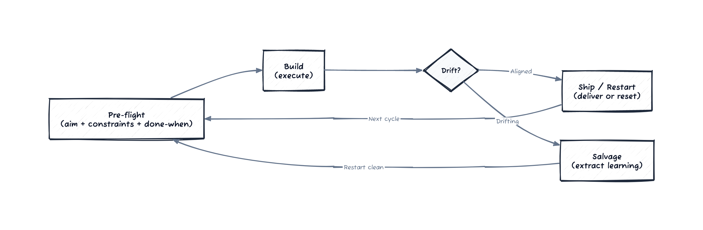

# Episode 3 — The Manifest

SablePay was the client you hired Northstar for when you wanted to ship fast and clean.

They had strong engineers and a good product. They also had a quiet leak: every project relied on a few people remembering how things worked. The rest of the team spent their time reloading context.
In fintech, that tax is expensive: a wrong webhook can freeze money movement, and an audit finding turns into months of paperwork.

Kieran liked SablePay immediately. "This is my kind of place," he said on day two. "Minimal ceremony. Smart people. They move."

Two weeks in, he was still saying it. He was also still doing the same thing each time he opened a new agent session.

He spun up a task to add a fraud-check hook to a new partner flow. He opened a new chat, pasted in the ticket, and typed his standard questions:

Where is the schema?
What is the PR format?
How do we run tests?
Which service owns this endpoint?
What are the "don't do this" rules?

Then he went to Slack and asked some of the same questions anyway, because the answers he got from the agent were stale. He pulled up a doc to cross-check, and then a runbook, and then the repository root. Fifteen minutes passed before he touched the code.

By the time he had a local branch, he had already spent half his energy on context he would have to reassemble next week.

Later that afternoon he sat through a release sync and watched the same tax repeat in public. A teammate asked which service owned the partner webhook. Another asked if the new rule engine lived behind a feature flag. The answers came from two different people in two different threads, and neither answer included a link. Kieran copied both into a scratch file called `notes-kieran.txt` with a plan to clean it up later. He never did. The scratch file grew anyway, a private map of the system that only he could navigate.

The next morning, he opened yet another agent session. He pasted in the ticket again, read the response again, and still felt the instinct to check with a human before he trusted it. The default path still ran through him.

Myles saw the pattern first. He had asked Jonah to scrape Kieran's last three sessions into a single diff. He didn't bring it up in front of anyone. He waited until Kieran was in the Northstar room with his second coffee.

"Got a minute?" Myles slid the laptop across the table.

On the screen were three columns. Each was a session transcript. In each, a familiar block repeated.

**reminder:** the schema lives in `apps/ledger/schema`
**reminder:** PR template is in `.github/pull_request_template.md`
**reminder:** run tests with `pnpm test:ledger`
**reminder:** ownership map is in `docs/services/`

Kieran blinked. "Okay. But that's normal. It's onboarding."

"It's expensive," Myles said. "Not in tokens. In attention."

He tapped the screen. "You keep paying the same search costs. Humans can manage only limited concurrent conversations; meetings are serial; attention and comprehension are finite. That line is about orgs, but it's about your brain too. You're spending it on reload, not work."

Kieran frowned. "So we document better?"

"We package better," Jonah said from the doorway. "Documentation is a pile. A manifest is a path."

Rina was the one who got them into a room. A glass box with a whiteboard and a stubborn echo. She listened to them repeat the same argument for five minutes and then put her marker down.

"Kieran, what problem do you think Myles is solving with all this setup?"

Kieran shrugged. "He doesn't want to type the same stuff."

"Close," Jonah said. "He doesn't want the team to rediscover the same stuff."

Myles opened a shared doc and pulled the keyboard toward him.

"Let's do it clean," he said. "We stay on the loop."

## /aim

Myles typed the command into the doc like it was a ritual.

**Aim:** SablePay can start any agent session with the right context, the right constraints, and the right path to ship, without a senior engineer in the loop.

Kieran leaned back. "That's a big swing for a doc."

"It's not a doc," Rina said. "It's a default. The aim is behavior change. We are done when the default path is the good path."

Jonah nodded. "The moment a junior can open a story and get to a correct change without paging you, we've won."

Myles didn't wait. He kept typing.

## /problem-space

**Optimization target:** reduce time-to-first-correct-change on a new story.  
**Constraints treated as real:** regulated money movement, release cadence, onboarding time, existing architecture, security policy.  
**Landmines:** hidden coupling, inconsistent review norms, fragile deploy steps, ownership ambiguity.

Kieran was quiet for once. The list was uncomfortable. It named things he had been navigating by intuition.

"So far this is still the same play," he said. "We list pain. Then we write a checklist."

"Not yet," Myles said. "Before we start drafting, we run pre-flight."

## /execute

Myles typed the command and made it explicit.

Pre-flight:
- confirm scope: manifest is defaults, not a constitution
- gather sources: current docs, known tribal notes, existing scripts
- identify owner: one maintainer, one backup, revisit dates
- list constraints we will codify and constraints we will only reference
- decide what we will *not* include yet

Build:
- draft Manifest v0 outline
- fill in missing sources of truth
- tag each guardrail with boundary, why, and revisit trigger

Detect drift:
- if this turns into a tool debate, stop and reframe
- if we add rules without evidence, stop and ask for dissent

Ship:
- publish in repo root
- announce in #eng, ask for one dissent memo

Kieran laughed. "You just used /execute on a document."

"We use it on anything that can drift," Myles said. "Especially things that feel obvious."

Rina pointed to the last line. "Ask for dissent?"

"It's how we keep decision debt from sneaking in as policy," Jonah said. "If we don't make disagreement safe, the manifest becomes politics."

That was the moment the room stopped feeling like a meeting. It felt like a design session.

Myles erased a line from the whiteboard and rewrote the problem statement.

## /problem-statement

Old statement: "How do we write better prompts?"  
New statement: "How do we package local wisdom so the next session starts closer to truth?"

Kieran stared at the line. "That's... different."

"That's the point," Myles said. "If your statement doesn't change, you keep building tarps."

Jonah added a note under it.

**Local wisdom = standards + guardrails + paths + context.**

Rina circled it. "This is the crux. The manifest is a packaging problem. Not a tool problem."

Kieran rolled his chair closer. "Okay, show me."

---

They drafted like a team that had finally agreed on the same horizon. Short bursts, fast edits, no decorative flourishes. Jonah kept it concrete. Rina kept it adoptable. Myles kept it tight.

At the top of the doc, they typed the name of the artifact in plain text:

**Manifest v0 — SablePay**

Then the outline appeared. It was simple enough to read in a minute and real enough to matter.

Manifest v0 outline:
- **Tools** (required installs, versions, and quick-start scripts)
- **Session injections** (what loads at session start: repo map, ownership map, context links, open risks)
- **Build** (local setup, dev commands, test gates, and how to reproduce issues)
- **Review** (PR format, review expectations, what evidence is required)
- **Ship** (deploy steps, rollback rules, release windows)
- **Sources of truth** (where the canonical docs live and who owns them)

Kieran skimmed it and felt the shape of his own habits. "This is what I do in my head, but spread across random README files and my own memory."

"Exactly," Myles said. "Primitive doesn't mean wrong. It means you're paying the cost repeatedly."

Rina slid her notebook across. "We should anchor the injections around a short dive pack," she said. "Aim, constraints, landmines, and a pointer to this manifest. That's enough to stop the chaos dragon without scaring people."

Jonah looked up. "And we need to name a rule about guardrails expiring. Otherwise this thing becomes a museum."

Kieran raised an eyebrow. "Expiring guardrails?"

"Sunset clauses," Jonah said. "Every constraint gets a revisit date. If no one renews it, it stops being enforced."

Myles nodded. "We call it out explicitly. Otherwise we get silent ossification."

Rina tapped the whiteboard. "Put it in the manifest. People forget to do what feels optional."

They paused on the line about sources of truth. It was shorter than the rest but it carried most of the weight. Without it, the whole outline was just another doc.

Myles spoke quietly. "This is why the docs never work. We never tell people which truth counts."

Kieran leaned forward. "If we do that, won't we slow them down?"

"We speed them up," Rina said. "We reduce search and negotiation. If you don't know which doc is real, you have to find a person. That's the tax."

Myles opened a second page and started to list the actual sources. The repo map. The service ownership register. The deployment runbook. The policy exceptions log. The decision register. He kept it tight.

Kieran felt it click again. "You're collapsing the search cost. That's the point."

"Exactly," Jonah said. "We are compressing transaction costs, not writing rules."

---

They saved the draft and then did the thing Jonah insisted on: a review of the manifest itself.

"If we don't review the manifest, it becomes a ritual," he said. "We don't have time for rituals."

Myles typed the command.

## /review

Drift risks:
- the manifest becomes a pile of rules no one understands
- the manifest gets copied without learning
- the manifest hardens into a gate instead of a path
- dissent becomes unsafe, and decision debt accumulates under the surface

Mitigations:
- keep defaults small; explicit fork path for teams and squads
- require a dissent memo for any rule that blocks shipping
- include the "why" with each constraint
- add a sunset clause for every guardrail (owner + revisit date)

Rina read the list and nodded. "This is where Dissent Mode belongs. If ticket thinking survives because it is emotionally safe, we have to make truth-telling safer than silence."

Kieran looked at the line about dissent memos. "So if someone thinks a rule is wrong, they have to write it down."

"Yes," Jonah said. "And the rule has to carry that dissent until it's resolved. It's how we keep decision debt visible."

"And the sunset clauses?" Kieran asked.

Myles pulled up a stub at the bottom of the doc and wrote the convention in plain language:

**Sunset clause convention**
- Every guardrail includes: boundary, why it exists, revisit date
- Revisit date defaults to 90 days unless explicitly shorter
- If the owner does not renew it, it becomes a recommendation, not a gate
- Any extension must cite evidence or incidents that justify keeping it

Kieran chewed on it. "So the manifest can't ossify unless we choose it."

"That's the point," Rina said. "We want constraints that keep learning alive, not policies that hide it."

They sat with the draft for a minute. It was still just an outline. But it was a shape that could hold the team.

Myles closed the laptop. "We ship v0. We ask for dissent. We update in a week."

Kieran nodded, slower this time. "I get it now." He looked at the whiteboard like it had taken longer to see than it should have. "It's not fancy setup. It's me paying the same costs over and over. You're just packaging my local wisdom so everyone pays once."

Rina smiled. That was the moment. Not compliance. Comprehension.

---

*The loop that prevents drift and captures learning:*

---

## End-of-Episode Memo (Northstar)

**What shifted**
- Curiosity: Kieran recognized the manifest as packaging local wisdom, not tooling cosplay.
- The team reframed the work from "prompts" to "defaults that reduce context reload."

**Commands used**
- `/aim` to define the team-level outcome
- `/problem-space` to surface landmines and constraints
- `/execute` to pre-flight the manifest build and prevent drift
- `/problem-statement` to pivot from "prompts" to "packaging wisdom"
- `/review` to prevent ossification and surface dissent

**Artifacts produced**
- **Manifest v0 — SablePay**: an outline covering tools, session injections, build/review/ship norms, and sources of truth; designed to get any session to a correct change without a senior in the loop.
- **Sunset Clause Convention**: a reusable rule for guardrails (boundary + why + revisit date + renewal evidence) so constraints expire unless deliberately renewed.

**Constraint discovered**
- Context reload is the hidden tax; without a manifest, every session pays it again.
