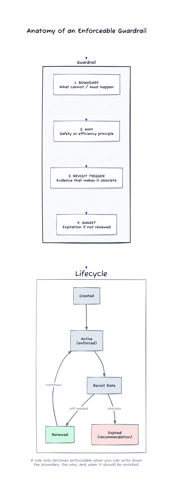

# Episode 4 — Guardrails Make Opinions Real

Aurum Devices built medical hardware. The stakes were different.

In the firmware lab, the workbench was still warm from a long run of stress tests. Kieran had an agent output open on his screen, scrolling through a clean, confident patch that adjusted calibration for a new sensor batch. The diff was short. The comments read like an expert.

"It wrote this in ninety minutes," he said.

The engineering director leaned over his shoulder. "Does it pass?"

"Unit tests, yes. The simulation suite is thin," Kieran said. "But the code looks right. It even added a test stub."

They moved to the rig. The latest firmware flashed in under a minute. The data looked smooth for the first ten seconds, then the trace drifted by a hair.

"That's within tolerance," the director said.

Myles watched the line on the monitor. "Not when you translate it into dosage." He tapped the screen. "That offset makes a slow error. It's the kind that gets past the first audit and then ruins a week of logs."

The room went quiet. No one had planned to be wrong that fast.

"If that drift showed up in the field, we'd file a report, not a pull request," the director said. He looked tired. "One audit, one recall, and this program goes dark for months."

Dax nodded once. "That's the non-ergodic part, right? One bad outcome and the distribution changes."

Rina looked at Kieran. "This isn't about blame. It's about whether we can trust the fastest path again."

"The change is good-looking," Rina said. "That's the problem."

Dax folded his arms. "We can't slow down. Our competitors won't."

Myles shook his head. "Speed is not the constraint. Verification is." He turned to the whiteboard. "We stop talking about faster. We talk about being right."

He picked up a marker.

## /aim

"What changes for Aurum if we get this right?" he asked.

He wrote:

Ship changes with:
- explicit constraints
- deterministic verification
- fast rollback paths

...so speed does not multiply risk.

Rina added a final line below it. "So humans can trust the system enough to use it."

"What behavior changes?" Myles asked.

"If we can't prove it, we don't merge it," Kieran said.

"And if it's a one-way door, we don't pretend it's a quick experiment," Rina added.

Kieran exhaled. "I feel like I'm guessing every time I merge."

"That's the bottleneck," Myles said. "And it's fixable." He pointed to the rig. "We can generate options all day. We cannot generate proof for free."

Jonah nodded. "LLMs collapse the cost of generating options. They do not collapse the cost of verification." He said it like a memo he had already written.

The director looked unconvinced. "So what's the move?"

Myles pushed the marker back to Jonah. "Run /solution-space. Make it real."

## /solution-space

Jonah wrote quickly.

**Tarp:** add a checklist. "Did you think about safety?"

**Nearest Peak:** add more review steps. Slow everything down.

**Beyond the Nearest Peak:** make verification cheap. Better tests, better simulators, better fixtures.

**Terraform:** make unsafe moves hard or impossible. Linters, gates, typed boundaries, policy-as-code.

The director stared at the list. "What's the trade?"

"Nearest Peak makes us feel safe without making us safe," Rina said. "Beyond is expensive. Terraform is enforceable."

"Phase gates keep the irreversible moves honest," Jonah said. "If a change is one-way, we make it pass a gate that proves reversibility or forces rollback readiness."

Myles tapped Terraform. "This is how we turn opinions into constraints."

Kieran said, "I keep stopping the agent when it does something wrong. I don't encode the rule."

Jonah pointed at the word Terraform. "We encode it or we repeat it."

The director hesitated. "You're talking about more rules."

"We are talking about fewer rules that matter," Rina said. "And a way to delete them."

Myles nodded. "Run /dissent. If this turns into bureaucracy, we kill it now."

## /dissent

Rina drew a line and wrote:

What would make this verification approach wrong?
- if we cannot reproduce failures deterministically
- if tests do not reflect real constraints
- if gates are arbitrary and block learning
- if we add rules faster than we delete them

The director pointed to the last bullet. "That's my fear. We become a paperwork shop."

Jonah underlined the sentence. "Then we build a promotion gate. Learning stays cheap. Rules stay expensive." He paused, then quoted the line he always used when the room got nervous. "A rule only becomes enforceable when a human can write down the boundary, the why, and when it should be revisited."

"And a sunset," Myles added. "No sunset, no rule."

They were quiet for a moment. It felt like a line was being drawn across the floor.

"Pick three," Jonah said. "Maybe four. Not thirty."

Rina opened a fresh doc and titled it **Aurum Guardrails v1**. She read the template aloud as she typed.

**Guardrail Set — Aurum Devices v1**

1) Boundary: Firmware never calls hardware interfaces directly; all access goes through the typed HAL boundary.
   Why: enforce safety invariants and make hardware state observable in tests.
   Revisit trigger: HAL coverage reaches 95% of register access paths.
   Sunset: auto-expire in 180 days unless renewed in /review.

2) Boundary: Any change to calibration logic requires a simulator run and a recorded artifact attached to the PR.
   Why: calibration errors are non-ergodic; a single wrong release can cause irreversible harm.
   Revisit trigger: simulator fidelity validated against 3 consecutive production lots.
   Sunset: auto-expire in 120 days unless renewed in /review.

3) Boundary: Agent-authored changes in safety-critical modules must include updated tests or a written test waiver approved by the safety lead.
   Why: a good-looking diff is not proof; verification is the constraint.
   Revisit trigger: test suite reaches target coverage for safety-critical modules.
   Sunset: auto-expire in 90 days unless renewed in /review.

4) Boundary: No merge to main without /review from the safety reviewer agent plus a human sign-off from the engineering director.
   Why: structured second opinions catch silent failure modes.
   Revisit trigger: two quarters with zero guardrail violations in CI.
   Sunset: auto-expire in 180 days unless renewed in /review.

The director read the list twice. "This is tighter than I expected," he said.

"That's the point," Jonah replied. "It is only enforceable if it is small."

Myles leaned in. "We are not writing policy. We are writing a safety system."

They pushed the document into the repo and Jonah opened the CI pipeline.

"I'm going to wire them in," he said. "That makes it real."

Kieran frowned. "What about the current mess?"

"It will break," Jonah said calmly. "And then we'll decide what to do."

He committed the first guardrail check. The pipeline lit up red.

Errors cascaded across the screen. Old hardware calls from three subsystems. Missing calibration artifacts on fifteen merged changes. A pile of unreviewed safety tweaks that had been waved through at midnight.

The director stared at the failures. "We can't fix all of this."

Myles did not argue. "We don't," he said. "We /execute a slice. Then we /salvage what we learned."

He wrote a new heading.

## /execute

Pre-flight:
- aim and constraints agreed
- guardrails selected (4)
- success criteria defined

Build:
- implement the typed HAL boundary on the battery monitor subsystem

Detect drift:
- if we spend time fixing legacy violations instead of enforcing new ones, abort

Salvage:
- extract the pattern, write the rule, restart on a clean slice

They chose the battery monitor because it was narrow and scary enough to matter. The next day, Jonah rewired the HAL boundary. Kieran updated the simulator to capture the edge cases that had been living in spreadsheets.

When the pipeline failed again, it failed in one place, not twenty. It was an old call that bypassed the boundary. The fix was clean. The next run was green.

"Now run /review," Rina said. "I want the safety reviewer to tell us what we missed."

## /review

They invoked the reviewer agent on the PR. It flagged a missing simulator artifact and pointed to a path where the calibration tolerance had been widened without a corresponding test.

Kieran grumbled. "I thought the new tests covered that."

"They don't," Jonah said. "They cover the happy path."

Jonah brought the review output up on the projector. It was not a verdict, it was a checklist: an untested tolerance range, a missing rollback note, and a question about which simulator artifact ID should be attached. The director leaned back. "Is this going to slow us down every time?"

"It slows us down once, at the boundary," Jonah said. "After that, it's automatic. That's why we wrote the boundary. If we don't enforce it here, we enforce it in the field."

The director signed only after the artifact was attached and the test was added. It took three hours. It felt like trust, not delay, and no one argued that clean diffs were evidence. They were learning to treat proof as the only currency.

By Friday, the new guardrails were enforcing themselves, and the legacy violations were cordoned off in a backlog labeled "pre-guardrail debt." The team had not fixed the past. They had contained it.

When the next PR failed, Myles called for a pause.

"We are drifting," he said. "Run /salvage before we restart."

## /salvage

They captured three things:
- the simulator needed one more fixture to model the new sensor batch
- the typed boundary reduced side effects but surfaced a hidden dependency in calibration
- the review agent caught a missing rollback note that no human would have noticed at speed

Jonah added a note in the guardrail doc: "Promotion gate passed for boundary guardrail. Revisit trigger updated." The system was learning without hardening too fast.

Dax walked in while they were writing. "We could ship today, right?" he asked.

Rina flipped the page to a fresh sheet. "Not until we run the phase gate." She wrote a header.

**Phase Gate Checklist — Pre-/ship**

- Reversibility: change is a two-way door; rollback path is documented and has been executed on the rig.
- Verification plan: simulator run + bench run completed; pass criteria captured in the PR.
- Rollback plan: owner and trigger defined; time-to-rollback measured.
- /review completed: safety reviewer agent + human sign-off recorded.
- Artifacts stored: test logs, simulator outputs, and calibration artifacts archived.

The director read the list. "We don't have rollback time measured."

"Then we don't /ship," Myles said. "Non-ergodic risk means we don't get a second chance."

Kieran ran the rollback drill on the rig. It took twelve minutes. They captured the steps, and the checklist went green.

When they finally shipped the change the following Monday, it was uneventful. That was the point.

Rina looked at the guardrail document on the wall. "This is the first time we've moved fast and felt safe," she said.

Kieran nodded. "It's not that I'm doing less. It's that the system is doing more." He tapped the typed boundary on the screen. "I don't have to be the safety net."

Myles watched the release complete. "Belief isn't a pep talk," he said. "It's a constraint you can prove."

---

*The anatomy of an enforceable constraint:*

---

## End-of-Episode Memo (Northstar)

**What shifted**
- Belief: guardrails moved from opinions to enforceable terrain; trust rose because the system made unsafe moves hard.

**Commands used**
- `/aim` to define safety as an outcome, not a feeling
- `/solution-space` to choose terraform over bureaucracy
- `/dissent` to keep guardrails small, intentional, and deletable
- `/execute` to run a narrow slice and surface drift early
- `/review` to force second opinions before merge
- `/salvage` to capture learning before restarting

**Constraint discovered**
- Verification is the bottleneck. Without enforceable guardrails, teams revert to manual heroics.

**Artifacts produced**
- **Guardrail Set — Aurum Devices v1:** four enforceable rules with boundary/why/revisit triggers and sunset clauses; designed to be promoted or expired based on evidence.
- **Phase Gate Checklist — Pre-/ship:** a reusable, safety-critical release gate that enforces reversibility, verification, and rollback readiness before shipping.
