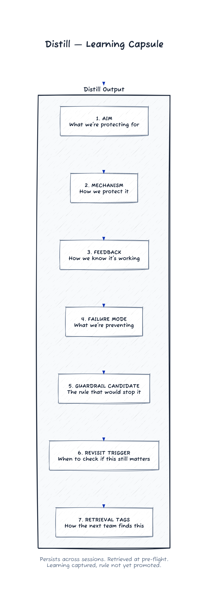

# Episode 5 — Distill (Team of Teams)

CinderCloud was a platform organization with a familiar smell: good people, fast motion, and institutional amnesia. Their enterprise customers had penalty clauses for prolonged outages, so “repeat the same failure” wasn’t just embarrassing—it was billable.

Every new team repeated the same arc:

1) ship quickly
2) hit a failure mode
3) invent a fix
4) forget the fix exists
5) repeat it on the next project

Dax called it “innovation.”

Myles called it “burning money.”

He’d seen the same failure twice in two months: two teams built separate “emergency bypasses” for a flaky dependency, and neither told the other. One shipped a fix with a silent retry loop. The other shipped a fix with a manual toggle. Both worked. Neither made it into a place the next team could find.

“So which one is right?” Dax had asked, half joking.

“Neither,” Jonah said. “They’re both dead the moment the team moves on.”

The first scene of the engagement wasn’t a kickoff. It was a failure review.

On a Monday, just after nine, three teams crowded into a glass room labeled “War.” A pipeline incident filled the screen: staging deploys blocked for six hours because the scanner went down and the approval bot flagged it as policy failure.

“It’s the third time this quarter,” Elena Park, the Platform Director, said, tapping the timeline. “Different team every time.”

A senior engineer shrugged. “We’re not a factory. We’re supposed to innovate.”

Myles held his stare. “Innovation is fine. Repeating a known failure isn’t. Acceleration multiplies motion. Alignment creates progress.”

The room went quiet. Kieran was the first to look down. He’d been the one to build the last fix. He’d left it in a repo no one had access to.

Rina broke the tension. “We’re not here to blame. We’re here to make the next team’s day shorter.”

They scheduled a workshop that afternoon. They invited all three teams and anyone who owned the delivery path.

## /problem-statement (reframing docs into retrieval)

The workshop started with a problem that felt simple and wrong: “How do we document what we learned?”

Rina opened a shared doc. She typed `/problem-statement` on the first line and hit enter.

“Old,” she said, and looked around the room. “Say it.”

A lead from the Release team spoke. “Old: how do we document what we learned?”

Rina nodded and typed it under the command.

“New,” Jonah said, before anyone else could. “How do we make the right knowledge show up at the right time, by default?”

Rina typed it in cleanly. Myles underlined it with the cursor.

An engineer in the back raised her hand. “We do retros. We already capture learning.”

“Where does it go?” Myles asked.

Silence.

“It goes into a doc that nobody reads,” Rina said, without judgment.

Jonah leaned forward. “Retros are not retrieval. If it can’t show up when you need it, it’s not learning. It’s trivia.”

Elena frowned. “So what are you proposing? A wiki? Another tool?”

“No,” Jonah said. “A promotion gate. Learning is cheap now. Rules are expensive forever.”

He tapped the table three times, counting on his fingers. “If you can’t write the boundary, the why, and when you’ll revisit it, it’s not a guardrail. It’s folklore.”

The compliance manager, who had been quiet, spoke up. “We still need an audit trail.”

Rina nodded. “You’ll get one. But it won’t be a graveyard. We’ll store the distills with the manifest and wire the retrieval into pre-flight. That’s auditable and alive.”

The manager glanced at her notes. “Alive is not a control term,” she said.

“Then we’ll call it ‘current,’” Rina said, and the room laughed.

Kieran smiled. That line had been on his screen saver for weeks.

Myles capped the marker and drew a box around the new problem statement. “We’re not writing a book. We’re building a reflex.”

## /execute (as an org habit)

Myles drew the loop on the whiteboard.

Pre-flight -> build -> detect drift -> salvage -> restart clean.

He wrote `/execute` above it and turned to the room. “This is the easy part,” he said. “Anyone can run a loop. The hard part is what you do with the learning so the next team starts in a better place.”

He pointed at Kieran. “Run it.”

Kieran stood up, opened the runbook, and said it out loud like a ritual: “We’re in `/execute`. Pre-flight starts now.”

He pulled up the manifest for the staging pipeline project. It had a single page of defaults: tools, guardrails, and a short list of “distills” from previous incidents.

Jonah added a new line to the pre-flight checklist: “Retrieve relevant learning.”

“How do we do that without making it another scavenger hunt?” Elena asked.

Jonah clicked into the manifest and ran a search by tags: staging, scanner, approvals, `/ship`. He dragged the results into the pre-flight section.

“That’s it,” Jonah said. “Pluck what’s relevant now. Don’t read everything. Read what the manifest tells you is relevant.”

He paused, then added, “And if it doesn’t show up, it doesn’t exist. That’s on us, not on the new team.”

The room watched the pre-flight list populate with three short entries. The newest one was Kieran’s own fix from last quarter, which nobody else had seen.

“Okay,” Kieran said quietly. “That would have saved us six hours.”

Myles nodded once. “Now you see the point.”

Elena crossed her arms. “Be honest. How long does this take on a good day?”

“Five minutes,” Jonah said. “Ten if the tags are a mess. The cost is a coffee. The payoff is not rebuilding a fix three times.”

Rina looked around the room. “We keep paying a transaction cost every time a team has to rediscover the same edge case. Retrieval is how we stop paying it over and over.”

## /review (drift detection in the open)

They ran the pipeline in a sandbox. The scanner was flaky by design that day; Jonah had set it to fail half its checks.

The approval bot halted the deploy. A junior engineer started to reach for a workaround.

Myles stopped her with a gesture. “Before we do anything, we `/review`.”

Rina typed the command into the room’s running doc. “What changed? What assumption is breaking?” she asked.

A release engineer read from the pre-flight distill. “Last time, the scanner outage got treated as a policy failure. We need the bot to classify scanner down as a separate state.”

Jonah snapped his fingers. “That’s not in the pipeline today. That’s why we’re stuck.”

Kieran looked at Elena. “We didn’t ignore this. We didn’t know it existed.”

Elena nodded slowly. “That’s the difference,” she said. “We’re not trying to remember. We’re trying to retrieve.”

## /salvage (the primary artifact)

They fixed the classifier in the sandbox. It wasn’t clean. It wasn’t even correct for all cases. It was enough to run the loop and learn what the fix needed to be.

Before they touched production, Jonah stopped them. “This part matters more than the code,” he said. “We `/salvage` while the pain is fresh.”

He opened a new entry in the manifest’s learning store and wrote the distill in front of everyone so it became a team object, not a personal note.

**Distill Output — Staging Scanner Drift**

Stored in: `manifest/learning/2026-01-21-staging-scanner-drift.md`

- **Aim:** Keep staging deploys unblocked when the scanner is down, without masking policy failures.
- **Mechanism:** Classify scanner-down as a separate state; approvals can proceed with an explicit warning.
- **Feedback:** Deploys with scanner-down should complete in <10 minutes and raise a visible alert.
- **Failure mode:** Approval bot treats scanner outage as policy failure, halting deploys for hours.
- **Guardrail candidate:** “Scanner-down is not a policy fail; require a warning + follow-up scan within 24 hours.”
- **Revisit trigger:** If warnings exceed 5/week or production scanners lag >48 hours.
- **Retrieval tags:** staging, scanner, approvals, `/ship`, guardrail-candidate

Kieran stared at the screen. “We used to argue in retros about writing this down,” he said. “Now it’s the thing that saves us next week.”

Myles pointed at the guardrail candidate line. “Learning captured. Rule not promoted yet. That’s the split.”
The propagation check pinged two other teams whose manifests carried the same scanner tags and asked if the candidate should apply there too. They left it as a suggestion until review.

Elena leaned back. “So this is the thing we keep. The code is disposable.”

Rina smiled. “Burn code, keep learning.”

The phrase stuck. Someone wrote it on the whiteboard and no one erased it.

## /ship (learning throttle)

The next conflict was predictable. Elena wanted outcomes yesterday. Myles wanted the delivery path to stop strangling feedback.

He wrote `/ship` on the board and circled it. “If the delivery path is painful, learning stalls. If learning stalls, the next team repeats the same mistake. We don’t need a new pipeline. We need one chokepoint to stop choking.”

They chose staging approvals. The approval bot waited on two signals: scanner status and policy checks. When the scanner failed, it treated it as a policy failure. That one decision stalled three teams and six features.

Jonah and Kieran paired with a CinderCloud release engineer and rewired the bot. They added a new “scanner-down” state, wrote a small warning banner, and made retries deterministic. They added a clear distinction between “scanner down” and “policy fail” so people stopped guessing.

The next deploy hit the same outage. This time, the approval bot displayed a warning, linked to the distill, and let the deploy proceed with a logged follow-up scan.

Elena looked at the timer. “Seven minutes,” she said. “We usually lose half a day.”

Myles said, “That’s the learning throttle. `/ship` isn’t about speed. It’s about feedback reaching the teams before the next team starts over.”

## Retrieval in pre-flight (manifest + guardrails)

Two weeks later, a new team spun up a service called EmberGate. They hadn’t been at the workshop. They had no scars from the staging pipeline.

Rina sat with them for ten minutes, opened the manifest, and pointed to a single step at the top of the pre-flight checklist: “Retrieval.”

She read it aloud. “Pluck what’s relevant now. Use the manifest to pull distills and guardrails before you build.”

The team lead, quiet but sharp, ran the step.

**Pre-Flight Retrieval Pattern — Manifest + Guardrails**

- **Step 1:** Read the manifest aim and delivery constraints.
- **Step 2:** Pull guardrails tagged for your component (staging, approvals, scanners).
- **Step 3:** Retrieve the top 3 distills by matching tags and recent failures.
- **Step 4:** Name the guardrail you’re most likely to hit during `/execute`.
- **Step 5:** Attach the distills to your runbook before you begin.

The lead blinked at the screen. “This is… short.”

“It’s supposed to be,” Jonah said. “If you can’t do it in five minutes, it won’t happen.”

They ran `/execute` with the distills attached. The team never hit the scanner failure at all. They read the guardrail candidate in advance and built the warning path from day one.

Later that afternoon, the lead walked past the War room and saw the whiteboard phrase.

“Burn code, keep learning,” she said out loud, like it was a policy.

It became one.

The next morning Elena showed up in the War room with a coffee and no slides. She wrote the phrase on the whiteboard again, larger this time, and turned to the leads who had been drifting in.

“We’ve tried ‘please read the docs,’” she said. “We’ve tried ‘remember what we learned.’ None of it scales. This does.”

She pointed at the top of the pre-flight checklist. “From now on: every new project starts with retrieval. Every incident ends with a distill. If it’s not in the manifest, it doesn’t exist.”

Someone started to object—*mandates*, *overhead*—and she cut it off before it could become a debate. “I’m not telling you which tools to use. I’m telling you what we keep. Five minutes up front is cheaper than six hours in this room.”

The EmberGate lead raised a hand. “Can I steal that pre-flight step for my team’s kickoff today?”

“Please,” Elena said, and smiled like it was the first good question she’d heard in months. She looked around the room. “Better: teach it. If you can show another team how to do it in ten minutes, we’ll make it the default.”

She capped the marker and wrote two more lines under the phrase:

RETRIEVE FIRST.
DISTILL ALWAYS.

“I want this in tomorrow’s engineering all-hands,” Elena said. “Ten minutes. No slides. One real distill, live. If it saves one team half a day, it pays for itself.”

Kieran watched the shift happen in real time: not compliance, not politeness—relief. The method had moved out of Northstar’s hands and into the client’s reflex.

By the end of week two, three teams had posted new distills without being asked, and the War room whiteboard carried the latest retrieval tags.

---

*The learning capsule that persists across sessions:*

---

## End-of-Episode Memo (Northstar)

**What shifted**
- Advancement: CinderCloud moved from “individual wisdom” to “team-of-teams compounding.”
- Retrieval replaced documentation; `/salvage` became the default artifact, not the retro doc.
- `/ship` was treated as a learning throttle so feedback reached teams before mistakes repeated.
- Elena Park started championing the method as a default reflex: “retrieve first, distill always.”

**Commands used**
- `/execute` as a shared habit, not a one-off
- `/review` to detect drift before changing production
- `/salvage` as the primary artifact (learning > code)
- `/problem-statement` to reframe documentation into retrieval-at-need
- `/ship` to reduce delivery-path tax and restore feedback flow

**Artifacts produced**
- **Distill Output — Staging Scanner Drift:** a reusable learning capsule stored in the manifest with aim, mechanism, feedback, guardrail candidate, and tags.
- **Pre-Flight Retrieval Pattern — Manifest + Guardrails:** a five-step checklist that pulls relevant distills and guardrails before `/execute`.

**Constraint discovered**
- Knowledge doesn’t compound without retrieval. Captured learning that can’t be replayed is lost.
